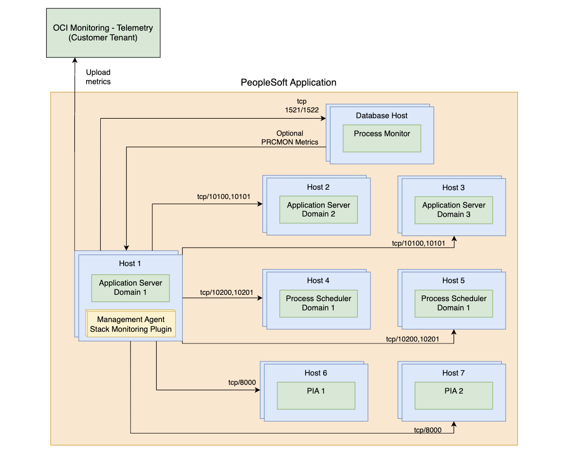
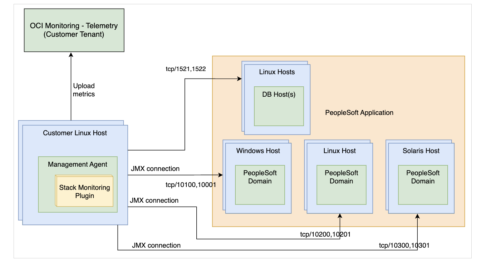
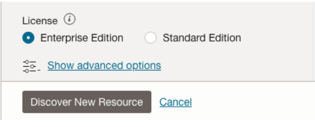
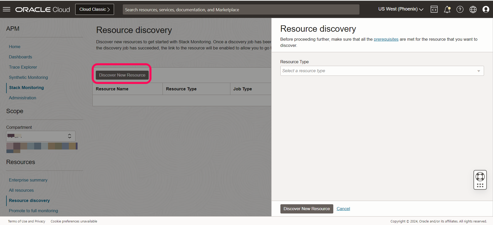

# Resource discovery using Stack Monitoring

## Introduction

In this lab, we will discover all the PeopleSoft resources configured earlier as part of the previous labs.

Estimated Time: 45 minutes

### Objectives

* Configuration options for distributed PSFT systems
* License Options within Stack Monitoring
* Resource discovery of PSFT components

### Prerequisites

*  Access to OCI Stack Monitoring page for the user.

## Task 1: Configuration options for distributed PSFT systems

 This workshop is based on discovering a PeopleSoft application with database, hosted on a single compute VM on OCI. So the application RMI ports, process scheduler RMI ports, webserver ports, database ports have not be opened through a firewall. The agent is also installed on the same compute VM.

 One of the many scenarios has been listed here, customers need to be aware of what ports need to be opened, when the application tiers (Application server, webserver, process scheduler server, database and elastic servers) are installed and configured in a distributed system.

 **Scenario 1**

 Monitoring agent is located on one of the PeopleSoft hosts itself and application tier spread across different VMs.
   
    

 **Scenario 2**

 Monitoring agent is located on different host and application tier spread across different VMs

    

## Task 2: License Options within Stack Monitoring

 OCI Stack Monitoring includes 2 types of licensing - Standard & Enterprise Licensing.
  By Default, when we discover the application, enterprise license option is selected. Enterprise option comes with a lot of added features but if customer wants to disable it, they can follow the below configuration.

 **Configure Licensing for Resource-Specific Features:**

 Resource license assignment can done at the individual resource level during discovery or after discovery within the Licensing UI.

 Note: License changes applied to a composite will apply to all children (e.g. When applying Enterprise Edition License to a WebLogic Domain, all WebLogic Servers associated to the domain will also receive the Enterprise Edition)

 **Configure Licensing for Resource-Specific Features during Discovery**

 During discovery, you may assign a license to the resource by selecting the corresponding radio button.

    

 **Configure Licensing for Resource-Specific Features after Discovery:**

 A resource license can also be modified after a resource has been discovered using the License UI. For example, to upgrade a Standard Edition resource to Enterprise Edition, navigate to the License UI and click the edit button within the Standard Edition box. The page will filter to only show resources with a Standard Edition license. Click the action button of the resource to upgrade and select Enterprise from the drop down. Continue this process for the remaining resources to upgrade from Standard to Enterprise Edition, finally select apply changes. When applying license changes, remain on the page until all updates have been applied.

    

## Task 3: Resource discovery of PSFT components

1. On the Oracle Cloud Infrastructure Console Home page, click the Navigation Menu in the upper-left corner, select Observability & Management, and then click Downloads and Keys under Management Agent.

   

 On the OCI Stack Monitoring page, click on Resource discovery.

   

 On the resource discovery page, click on discover new resource.

   

 As part of the discovery, we will first discover the Oracle database and then followed by the PeopleSoft application. Within Oracle database, we will first discover CDB database (if there is a multi-tenant architecture) and then followed by the PDB database.

## Summary

In this lab, we discovered the PeopleSoft application components using stack monitoring.

## Acknowledgements

* **Authors** - Deepak Kumar M, Principal Cloud Architect
* **Contributors** -

    * Aaron Rimel, Principal Product Manager
    * Devashish Bhargava, Principal Cloud Architect
* **Last Updated By/Date** - Deepak Kumar M, Principal Cloud Architect, February 2024

