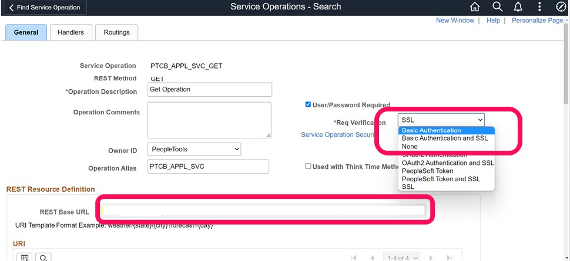

# Configure PeopleSoft for Oracle Digital Assistant

## Introduction

You will set up PeopleSoft for Oracle Digital Assistant integration in this lab to operate the PICASO chatbot.

Estimated Time: 1 hour

### Objectives

To configure PeopleSoft with Oracle Digital Assistant, you will:
*  Create a PROXY User
*  Uncheck Restricted Services
*  Disable SSL Check for Service Operation
*  Update Application Services Security
*  Global Chatbot Configuration

### Prerequisites
*  A PeopleSoft PIA Admin user to create and configure chatbot on PeopleSoft side
.

### Assumptions:
*  PeopleSoft Application Service is accessible on the open internet for the ODA Cloud instance to consume.
*  PeopleSoft holds a certificate signed by a valid CA and not a self-signed certificate
*  Integration Broker is configured, up and running
*  For the ease of documentation, we have taken “HCM” as the PeopleSoft application. However it can be extended for other pillars as well.
*  A user to authenticate PeopleSoft web services “PSFTPROXY” is created. Administrator may use appropriate user id and password based on your preference.

## Task 1:  Create a Proxy User

1. Login to PeopleSoft as an admin user and click on the navigation at the top right corner and then go to PeopleTools >> Security >> User Profiles

  

   Add a new user profile - PSFTPROXY, click on the Add button

  

   Select the Symbolic ID as SYSADM1, type your new password and confirm the password.

  
   
   On the ID tab, Update the ID type as "None"
  

   On the Roles tab, Update it with below roles and click save
  
   
   Make sure to add all additional roles
   PTCB\_USER
   EOCB Service User
   EOCB Admin User
   EOCB Client User
   Absence Chatbot Employee	
   Benefit Chatbot Employee	
   Employee Directory Chatbot	
   NA Payroll Chatbot User	

   For PeopleSoft Financial environment, add the below roles to the VP1 user or user working on the chatbot setup.

   EOCB Client User
   EXCB\_EXPENSE\_INQ
   PTCB\_USER
   EOCB Service User
   EOCB Admin User
   Employee Directory Chatbot	
   PeopleSoft User  
   ePro Requester Inquiry Bot

   
## Task 2: Uncheck Restricted Services

1. Login to PeopleSoft as an admin user and click on the navigation at the top right corner and then go to PeopleTools >> Integration Broker >> Service Configuration. 

  

  Click on the Restricted services tab and search with "PTCB"
  
  

  Uncheck Restricted services  and save
  

## Task 3: Disable SSL Check for Service Operation

   **Important:** This setting is for configuring a non-SSL URL for a DEMO environment; in actual production environments, it is advised to use SSL certificates for configuration as opposed to disabling SSL.

1. Login to PeopleSoft as an admin user and click on the navigation at the top right corner and then go to PeopleTools >> Integration Broker >> Integration Setup >> Service Operation Definitions. 

  

  Search with Service Operation "PTCB\_APPL\_SVC"

    
  
  Update the req. verification field as "Basic Authentication" instead of "SSL" for both Service Operations "PTCB\_APPL\_SVC_GET" and "PTCB\_APPL\_SVC\_POST"

    

    *Note:* Make a note of the masked REST Base URL as this would be required to update the ODA skill configuration page

## Task 4: Update Application Services Security

1. Login to PeopleSoft as an admin user and click on the navigation at the top right corner and then go to PeopleTools >> Integration Broker >> Application Services >> Application Services Security

  

  Click on the Token required tab, expand chatbot token type and change from oAuth2 to PSFT and click save

    

## Task 5: Global Chatbot Configuration

1. Login to PeopleSoft as an admin user and click on the navigation at the top right corner and then go to Menu >> Enterprise Components >> Global Chatbot Configuration

  

  Copy the ODA server URI from the lab1 and paste it under general configurations and save it

    
  
  Click Add under Global Configurations for Skills and Digital Assistants

    
  
  Click add from Bot Definitions and fill it with below details (the bot channel id comes from ODA page which was noted earlier), click done

    

    click next
    

    Fill the information as per the screen and click next
    

    click submit
    

    Enable the PSFT-ODA bot from this screen and save it
    

    The chatbot should now appear on the home screen
    

## Summary

In this lab, you have configured PeopleSoft for Oracle Digital Assistant integration to run the PICASO chatbot.

You may now **proceed to the next lab.**

## Acknowledgements
* **Authors** - Deepak Kumar M, Principal Cloud Architect
* **Contributors** - Deepak Kumar M, Principal Cloud Architect
* **Last Updated By/Date** - Deepak Kumar M, Principal Cloud Architect, March 2023

